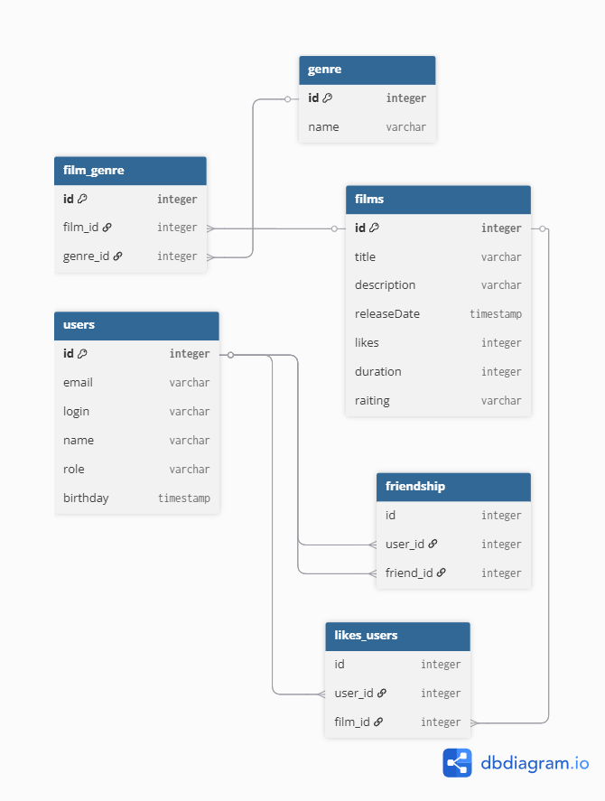

# java-filmorate




## Структура базы данных:
- **users** - таблица с пользователями
- **films** - таблица с фильмами
- **friendship** - таблица с друзьями
- **genre** - таблица с жанрами фильмов
- **likes_users** - таблица-посредник (id фильмов и id пользователей, которые их оценили)
- **film_genre** - таблица-посредник (id фильма и id жанра)

---

## Примеры запросов к бд : 

### 1. Получить все фильмы
```sql
SELECT f.name
FROM films AS f;
```

### Топ N самых популярных фильмов:
```
SELECT f.name,
f.likes
FROM films AS f
ORDER BY f.likes DESC
LIMIT N;
```

### Получение всех пользователей:
```
SELECT u.name
FROM users AS u;
```

### Получение списка общих друзей:
```
SELECT f1.friend_id as общий_друг
FROM friendships f1
INNER JOIN friendships f2 ON f1.friend_id = f2.friend_id
WHERE f1.user_id = 1
AND f2.user_id = 2
```


